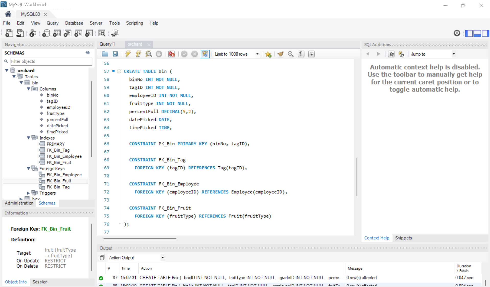

# Orchard Database (SQL Project)

Relational database design (MySQL) based on a provided orchard ERD, with primary/foreign key constraints and data integrity enforcement.

## Overview

Designing and implementing a relational database for an orchard management system from a provided ERD — translating business requirements into a structured, normalised (3NF) schema.

## Schema



Full ERD: [Orchard_Database_ERD.pdf](Orchard_Database_ERD.pdf)

## Key features

- Normalised relational schema (3NF)
- Primary and foreign key constraints
- One-to-many and many-to-many relationships (via associative tables)
- Data integrity enforcement
- Self-referencing relationships (employee hierarchy)

## Database structure

Core entities: Employee (with manager hierarchy), Position, Fruit, Bin and Tag tracking, Box and Grade classification. Associative tables resolve many-to-many relationships.

## Structure

```
orchard-database-sql/
├── orchard.sql               # full database creation script
├── Orchard_Database_ERD.pdf  # entity relationship diagram
├── mysql_orchard_schema.png  # schema screenshot
└── LICENSE
```

## Tech stack

MySQL · MySQL Workbench · SQL (DDL)

## What I learned

- Translating ERDs into physical database design
- Implementing constraints for data integrity
- Structuring real-world operational data
- Understanding relationships between entities in a business context

## Author

Gabriela Olivera · [LinkedIn](https://www.linkedin.com/in/gabriela-olivera-nz) · [GitHub](https://github.com/gabrielaoliveranz)
